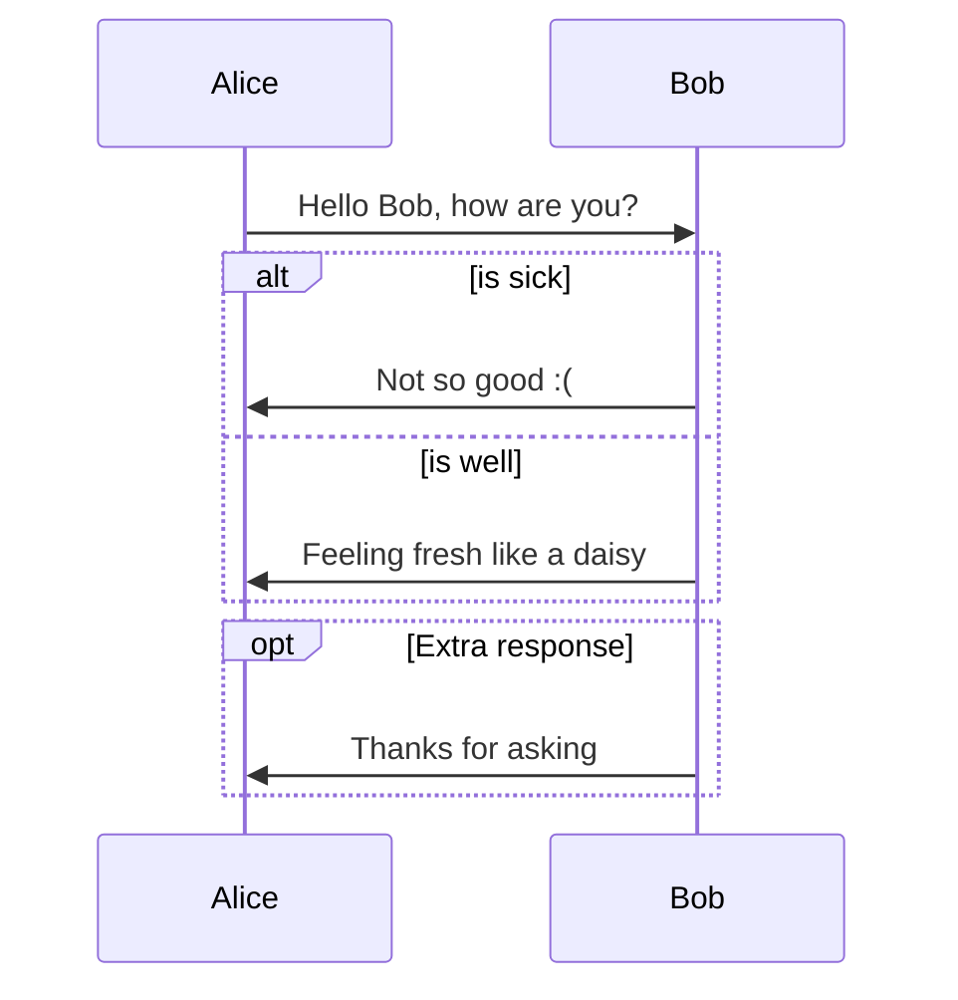
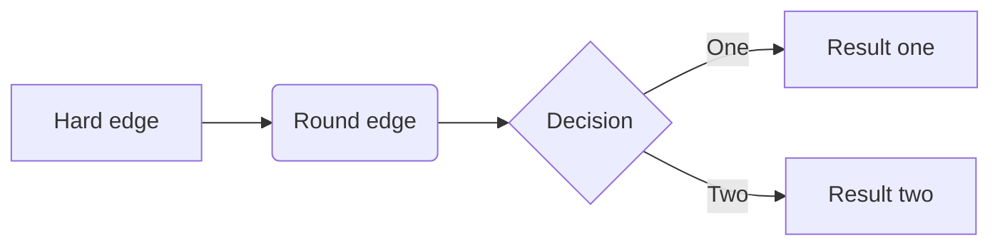
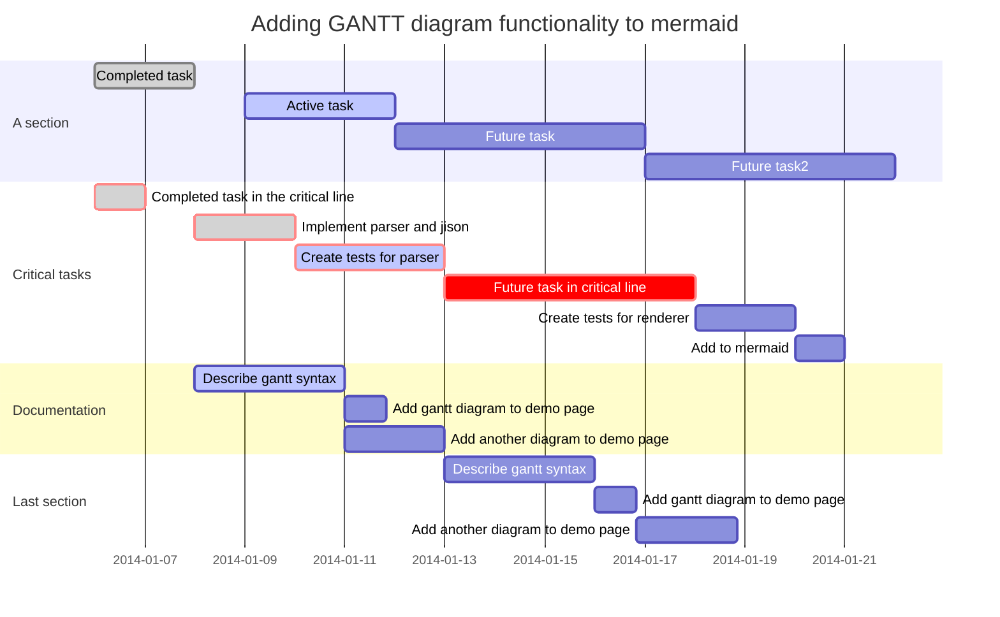

# Szybkie notatki


## co do nauki?

1. rhcsa (minium co ogarniać to storage, network, user groups, systemctl, acl i uprawnienia)

2. ansible

3. python + flask + restful api i jakiś fajny projekt napisać

4. itil,

5. angielski


## ansible warsztat na kontenerach

wziąć fedore albo rhel8 i za pomocą tego podmana czy jak to tam się nazywa zrobić 3-4 kontenery

0 Controller ansible + cockpit?

1 serwer apache + php

2 server mysql + postgres

3 workstacja czy cos?

ewentualnie później host który jeste FTPem + repozytorium RPM? albo jakaś samba? serwer plików, NAS SAN LUN NFS? i podpiąć ten lun na innym hoście?

ewentualnie serwer node.js z jakimś menagerem tasków?


zrobić userów technicznych

minimum dwa  moze trzy grupy systemów

controllers

servers

workstations

site 0

site 1


zrobić playbooki na:

instalacja, deinstalacja, aktualizacja pakietów

aktualizacja systemu

informacje o hoście

informacje o PROC/RAM/storage danego hosta

listing procesów

listing katalogu/plików

listing statusu połączenia/pinga wszystkich hostów

włączenie/wyłączenie/status usługi

listowanie repo i listowanie dostępnych/zainstalowanych pakietów

dodawanie repo

SCP miedzy hostem a kontrolerem?


utworzyć własne obrazy kontenerów czy też plików tekstowych żeby taki obraz się sam tworzył i go opublikować dla innych.


## Informacje o komputerze

Hostnamectl status


zmiana hostname

hostnamectl set-hostname localhost.localdomain


włączenie obsługi aktualizacji delta (uwaga obciąża CPU, zmniejsza obciążenie sieciowe)

## Konfiguracja virtualbox:


## do nauki na pamięć

Linux

### Oprogramowanie

- Lista zainstalowanego oprogramowania yum list installed
- Lista możliwego oprogramowania yum list available
- Lista repozytorium yum repolist all
- Wyszukiwanie w tych listach | grep, yum search
- Instalowanie, usuwanie, czyszczenie oprogramowania yum install, yum remove, yum autoremove
- Aktywacja, deaktywacja, aktualizacja repozytoriów yum update, 
- Zarządzanie kluczami GPG
- Jakie program ma zależności i jakich plików używa?

### Procesy

- Lista aktualnych procesów
- Zabijanie procesów
- Aktywacja/status/Restart/wylączenie usług
- echo $?, pipe >> || && jakie są różnice |

### Storage

- Montowanie/demontowanie dysków
- Formatowanie dysków
- Listowanie dysków
- fstab / automatyczne montowanie dysków
- Jak wyświetlić uidy dysków
- Tworzenie/usuwanie/przenoszenie/zmiana nazwy/CHMOD/CHOWN/ACL plików, folderów
- SELinux Dodawanie usuwanie polityk, włączanie wyłączanie, listowanie
- hard i symlinki

### Networking/Firewall

- Czy jest połączenie po IP i po porcie?
- Jaki adres ma to IP? Jakie IP ma dany adres?
- Firewall, dodanie, usuwanie, modyfikowanie, listowanie reguł
- Z jakiego interfejsu idzie dany pakiet?
- Tablica routingu
- Listing interfejsów
- Hostname ustawienia i wyśtwietlenie, uptime itd

### Użytkownicy/Grupy

- Dodanie, usuwanie, edytowanie użytkowników
- CHMOD/CHOWN/ACL (patrz storage)

### Kernel

- Listowanie modułów (działających, wszystkich)
- Włązanie, wyłączanie, restartowanie modułów
- Jakich modułów używa program???? 
- Autostart modułów?

### Włączenie, wyłączenie, wylogowanie

- Włączanie
- Wyłączanie
- wylogowanie
- kto jest zalogowany?
- historia ostatnich komend
- VIM VI
- SCP
- ssh - jakieś komendy do tego?
- grep less cat more

Windows

### Procesy

- Lista aktualnych procesów
- Zabijanie procesów
- Aktywacja/status/Restart/wylączenie usług

### Storage

- Montowanie/demontowanie dysków
- Formatowanie dysków
- Listowanie dysków
- automatyczne montowanie dysków
- Jak wyświetlić uidy dysków
- Tworzenie/usuwanie/przenoszenie/zmiana nazwy/CHMOD/CHOWN/ACL plików, folderów

### Networking/Firewall

- Czy jest połączenie po IP i po porcie?
- Jaki adres ma to IP? Jakie IP ma dany adres?
- Firewall, dodanie, usuwanie, modyfikowanie, listowanie reguł
- Z jakiego interfejsu idzie dany pakiet?
- Tablica routingu
- Listing interfejsów
- Active Directory (jakieś podstawowe komendy)

### Użytkownicy/Grupy

- Dodanie, usuwanie, edytowanie użytkowników
- CHMOD/CHOWN/ACL (patrz storage)

### Włączenie, wyłączenie, wylogowanie

- Włączanie
- Wyłączanie
- wylogowanie
- kto jest zalogowany?
- historia ostatnich komend
- VIM VI
- SCP
- ssh - jakieś komendy do tego?
- grep less cat more


przekierowania portów na wirtualboksie:

ssh root@localhost -p 2222
http://localhost:8080


UPC FREE WI FI
5bc0e488-1064-4398-8835-e656124fe127


**Mateusz Stomski**

Raciborska 22/15B 

 40-074  	 	Katowice

ŚLĄSKIE

Polska

Telefon komórkowy: +48 887666606 		

## Sequence

```sequence
Alice->Bob: Hello Bob, how are you?
Note right of Bob: Bob thinks
Bob-->Alice: I am good thanks!
```

## Flowchart

```flow
st=>start: Start
op=>operation: Your Operation
cond=>condition: Yes or No?
e=>end

st->op->cond
cond(yes)->e
cond(no)->op
```


## Mermaid







